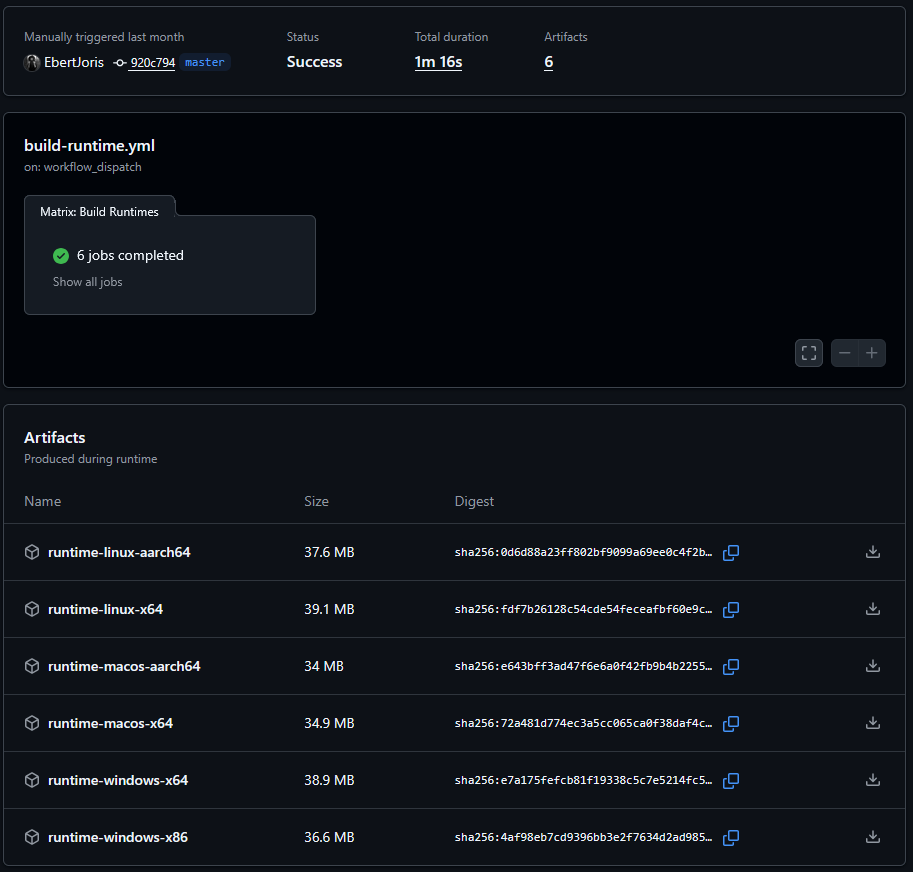

Use the fork we got from my runtime generator repository (https://github.com/jorisebert-tech/jar-client-runtime-generator)
I forked it myself from my main repository. This includes changes to support your client.

1. Clone the repository
2. Update the client.jar
3. Change the runtime-config.json file to have the correct javaVersion
4. Commit and push to master
5. The runtimes will be generated when the workflow is triggered
6. Download the generated runtimes. 
7. Take out the zip files in each of the generated runtimes zip and place them in this repository under the runtimes folder.